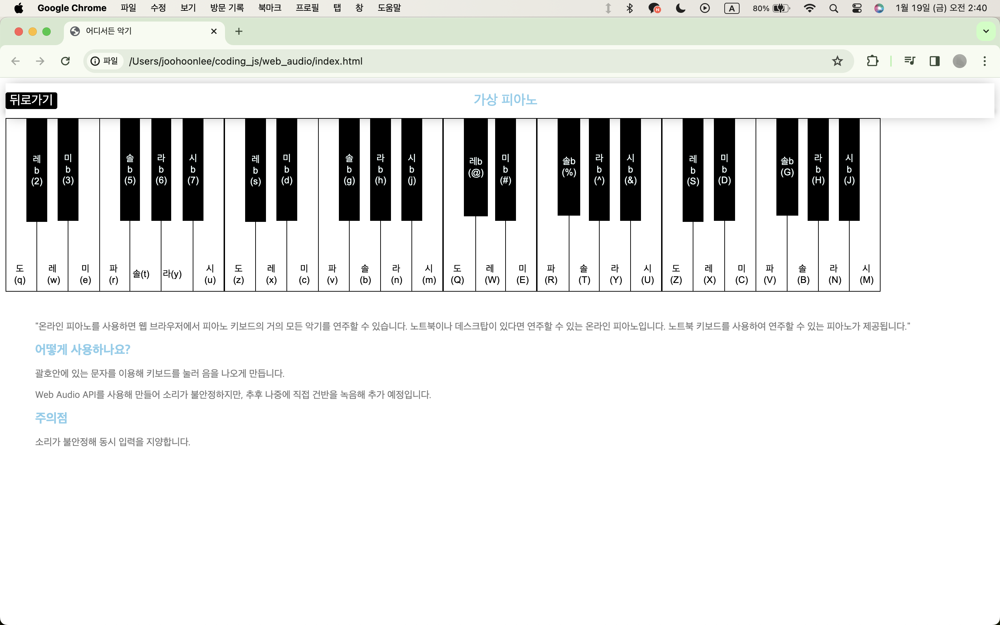

# 어디서든 악기

# 어디서든 악기 Web page
> **한경대학교 컴퓨터공학과 소프트웨어융합 학부생**

> **개발기간:2023.08.20 - 2023.08.31**

## 웹개발팀 소개
|      이주훈       |
| :-------------: |
|   [@whdjh](https://github.com/whdjh)   |
| 한경대 컴퓨터공학과 sc 3학년 |

## 프로젝트 소개
가상 피아노인 사이드 토이 웹 프로젝트는 실제 악기 없이 음악을 연습하고 탐구해야 할 필요성에서 개발했습니다. 

이는 사용자가 언제 어디서나 관심을 평가하고 피아노를 연습할 수 있는 다용도 도구 역할을 하고 편리함과 즐거움을 위해 개발되었습니다. 

웹 페이지는 음악적 탐구가 모든 사람이 접근할 수 있어야 한다는 믿음을 반영합니다. 

## 기술스택

## 개발 환경

             

## 화면 구성 📺

## 주요 기능

### 키보드를 이용해 각 키매핑을 해서 음을 다르게 칠 수 있습니다.
  - 미흡 사항으론 동시 입력시 오류가 발생하는 오류가 있습니다.
  - API가 다른 악기를 지원한다면 악기를 추가할 예정입니다.

## 코드 구조
* css
  - style.css
  
* js
  - main.js
  - piano.js

* index.html
